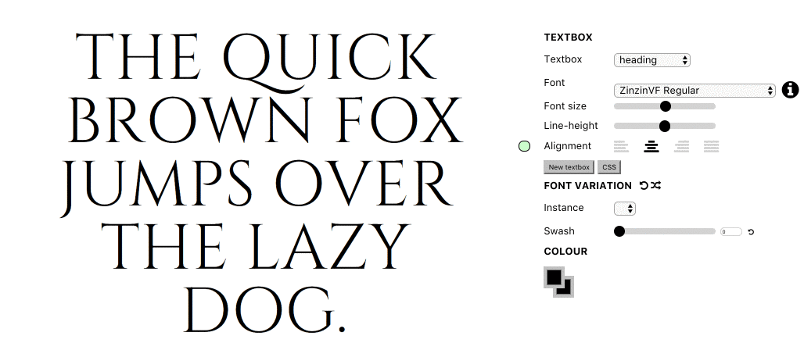

# Variable OpenType test fonts

## Zinzin VF (OFL)

### > [Download ZinzinVF.ttf ](https://github.com/twardoch/varfonts-ofl/blob/master/ZinzinVF-OFL/Fonts/ZinzinVF.ttf?raw=true)

The **Zinzin VF** is a variable OpenType test font based on [Cinzel and Cinzel Decorative](http://ndiscovered.com/cinzel/). 

The font has a `SWSH` axis which conditionally enables 350 lookups as the axis value progresses. The lookups gradually replace uppercase letters with swash variants, and lowercase letters with larger caps. It has an empty `gvar` table as it does not do any glyph variation, just feature variation. 

The font is for **test purposes**. 

### License

The fonts are licensed under the [SIL Open Font License version 1.1](./fonts.LICENSE). The tools and other content are licensed under the [Apache License version 2.0](./other.LICENSE).

Copyright © 2017 by [Adam Twardoch](https://github.com/twardoch/) and the original authors.
